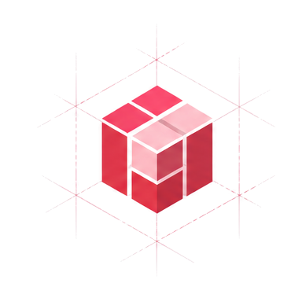
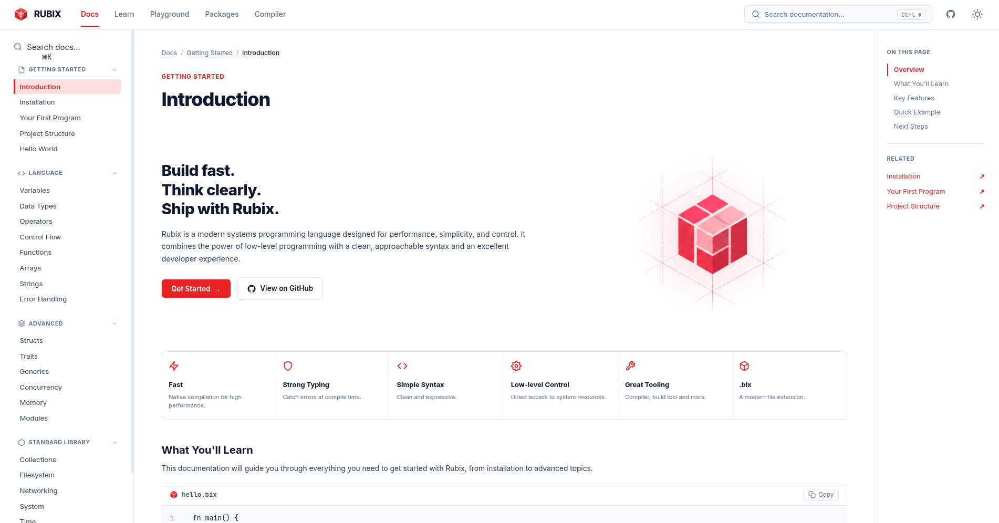
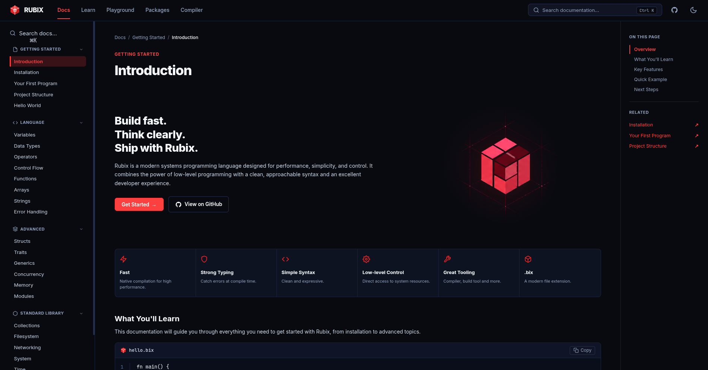

<div align="center">

  

  # Rubix Documentation

  <p><strong>Official documentation platform and interactive reference for Rubix - A modern systems programming language.</strong></p>

  <p>
    <a href="https://github.com/tek-sys-hub/rubix-documentation"></a>
    <a href="https://vitejs.dev/"></a>
    <a href="https://react.dev/"></a>
    <a href="LICENSE"></a>
    <a href="https://github.com/tek-sys-hub/rubix-documentation/pulls"></a>
  </p>

</div>

---

## 📸 User Interface Preview

### Light Mode


### Dark Mode


---

## ⚡ Highlights & Features

- **🎨 Modern Design System**: Pixel-perfect aesthetic matching the Rubix brand identity with custom isometric 3D hero cube, rich crimson accents, and clean typography.
- **🔍 Animated FastSearch Modal**:
  - Global keyboard shortcut (`Ctrl + K` / `Cmd + K`) and tactile search button triggers.
  - Spring-animated popup modal with smooth backdrop blur.
  - Live query match highlighting across titles and descriptions.
  - Categorized chips (`All`, `Getting Started`, `Language`, `Advanced`, `Standard Library`, `CLI & Modules`).
  - Full keyboard navigation (`↑` `↓` `↵` `Esc`) and smart empty states with popular suggestions.
- **📱 Phone & Mobile Optimized**:
  - Responsive header with dedicated search action.
  - Drawer sidebar navigation with integrated search bar.
  - Touch-safe modal popup, iOS auto-zoom prevention (16px input scaling), and momentum touch scrolling.
- **🌓 Dual Theme Engine**:
  - Zero-flicker light and dark mode toggle.
  - Automatic persistence with `localStorage` and `data-theme` attribute synchronization.
- **💻 Syntax Highlighting & Code Playground**:
  - Integrated code blocks with line numbers, copy-to-clipboard status feedback, and sample `.bix` scripts.
  - Live execution preview simulator with preset switches.
- **📐 Edge-to-Edge Full Bleed Layout**:
  - Sticky sidebars with synchronized table-of-contents tracking (`On this page`).
  - Independent scrolling containers with custom scrollbars.

---

## ⌨️ Keyboard Shortcuts

| Shortcut | Action |
|:---|:---|
| <kbd>Ctrl</kbd> + <kbd>K</kbd> / <kbd>⌘</kbd> + <kbd>K</kbd> | Open Search Popup |
| <kbd>↑</kbd> / <kbd>↓</kbd> | Navigate search results |
| <kbd>Enter</kbd> | Jump to selected documentation section |
| <kbd>Esc</kbd> | Close search popup / modal |

---

## 📂 Project Architecture

```
rubix-documentation/
├── public/                     # Public static assets & brand graphics
│   ├── rubix-hero-cube-clean.png
│   └── favicon.svg
├── src/
│   ├── assets/                 # Icons & bundled vector assets
│   ├── components/             # Reusable UI components
│   │   ├── Header.jsx          # Top navigation bar & search trigger
│   │   ├── SearchModal.jsx     # Spring-animated search popup & filters
│   │   ├── CodeBlock.jsx       # Syntax highlighting & copy feedback
│   │   ├── Modals.jsx          # Share dialog & toast bubbles
│   │   └── Footer.jsx          # Documentation page footer
│   ├── data/
│   │   └── docsData.js         # Single source of truth (navigation, search index, code samples)
│   ├── lib/
│   │   ├── clipboard.js        # Copy helper with fallback support
│   │   └── preview.js          # Interactive playground simulation engine
│   ├── pages/
│   │   ├── DocsLayout.jsx      # Main documentation layout & mobile drawer
│   │   └── HomePage.jsx        # Landing presentation view
│   ├── App.jsx                 # Route manager, theme provider, and global shortcuts
│   ├── index.css               # Vanilla CSS design tokens, keyframes & responsive rules
│   └── main.jsx                # Application root entry point
├── ui/                         # UI showcase screenshots
│   ├── frontend-light.png      # Light theme desktop screenshot
│   └── frontend-dark.png       # Dark theme desktop screenshot
├── package.json
└── vite.config.js
```

---

## 🚀 Getting Started

### Prerequisites

- [Node.js](https://nodejs.org/) (version 18.0.0 or higher recommended)
- [npm](https://www.npmjs.com/) or [pnpm](https://pnpm.io/) or [yarn](https://yarnpkg.com/)

### Installation

1. **Clone the repository:**
   ```bash
   git clone https://github.com/tek-sys-hub/rubix-documentation.git
   cd rubix-documentation
   ```

2. **Install dependencies:**
   ```bash
   npm install
   ```

3. **Start the local development server:**
   ```bash
   npm run dev
   ```
   Open [http://localhost:5173](http://localhost:5173) in your browser to view the application.

4. **Build for production:**
   ```bash
   npm run build
   ```

5. **Preview production bundle:**
   ```bash
   npm run preview
   ```

---

## 🛠️ Technology Stack

- **Core**: React 19, JavaScript (ESNext)
- **Bundler & Tooling**: [Vite](https://vitejs.dev/) with Fast Refresh
- **Styling**: Vanilla CSS with tailored design tokens, HSL color space, and custom keyframe animations
- **Icons**: Handcrafted lightweight SVGs

---

## 📄 License

This project is licensed under the [MIT License](LICENSE).
